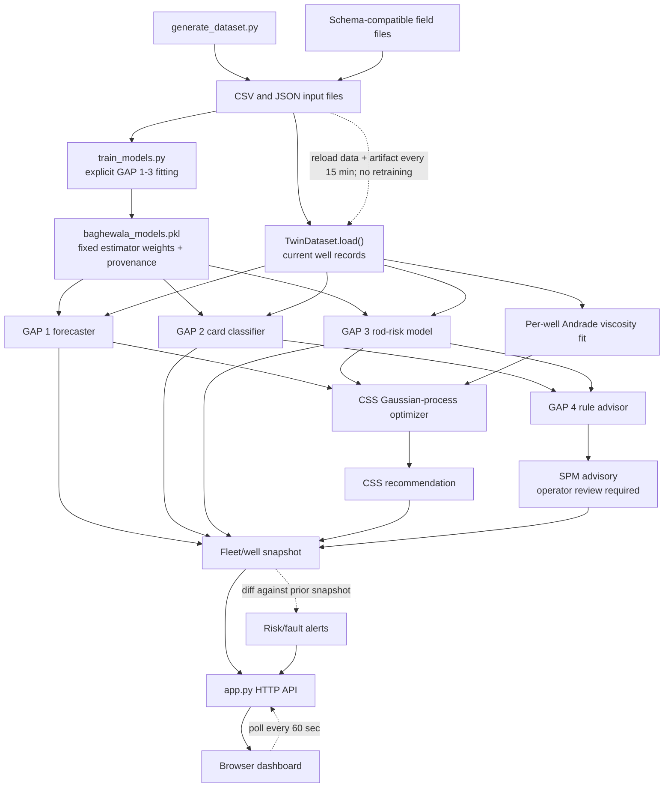

# Baghewala Well-to-Surface Digital Twin

A synthetic-data prototype that connects cyclic steam stimulation (CSS), heavy-oil production, and sucker-rod pumping (SRP). It includes the ML models, a persisted model artifact, an HTTP API, and an interactive operations dashboard.

> **Important:** Bundled and generated data are synthetic. Model outputs are not validated field forecasts or operating instructions. Do not use this artifact for production, safety, or workover decisions.

## Project Contents

```text
.
├── generate_dataset.py
├── train_models.py
├── model_store.py
├── model_artifacts/
│   └── baghewala_models.pkl
├── pipeline.py
├── app.py
├── dashboard/
│   ├── index.html
│   ├── styles.css
│   └── app.js
├── gap2_card_classifier.py
├── gap3_rod_risk_model.py
├── evaluate.py
├── requirements.txt
├── solution.md
└── baghewala_sample_dataset/
```

## Setup

Use Python 3.11 and the pinned scikit-learn version recorded in the artifact:

```bash
python -m pip install -r requirements.txt
```

Model files use joblib/pickle serialization. Only load trusted artifacts; loading an untrusted pickle can execute code.

## Train and Run

Train a model bundle for the dataset you intend to serve, then launch the app:

```bash
python generate_dataset.py
python train_models.py --data-dir baghewala_dataset
python app.py
```

The app loads the fitted GAP 1-3 estimators from `model_artifacts/baghewala_models.pkl`; it does not train models at startup. The artifact records the training timestamp, dataset fingerprint, and library versions. Its scikit-learn version must match the runtime. The dashboard shows whether the current input files match the artifact's training snapshot.

To train from the checked-in sample instead:

```bash
python train_models.py --data-dir baghewala_sample_dataset
```

Then set `BAGHEWALA_DATA_DIR` to `baghewala_sample_dataset` before starting `python app.py`. For real field deployment, prepare the seven schema-compatible data files, train an artifact from those authorized field records, validate it, and configure the app to use that data directory and artifact.

Open `http://127.0.0.1:8000`. Select a well and enter steam volume, injection pressure, and soak time to get a direct forecast from the saved GAP 1 model. The separate optimizer action searches for a candidate CSS design. SRP recommendations are advisory only; the app does not send commands to pumps or VFDs.

## Model Lifecycle

- GAP 1: a per-target `HistGradientBoostingRegressor` forecaster.
- GAP 2: an enriched, class-balanced `RandomForestClassifier` for dynamometer cards.
- GAP 3: regularized logistic regression estimating 30-day rod-failure risk from a well-day panel.
- GAP 4: a transparent rule-based SRP advisor; it is not serialized as a learned model.

Run `python train_models.py --data-dir path/to/dataset` to explicitly fit and save new GAP 1-3 weights. The script writes `model_artifacts/baghewala_models.pkl` atomically and stores training metadata. The running app's manual or scheduled refresh reloads data and that saved artifact; it does not retrain. After training a replacement artifact, request `POST /api/refresh` or use the dashboard refresh button to load it.

The dataset/artifact version and fingerprint make the source of the weights visible. They do not prove model quality: the bundled artifact was trained on synthetic records, and real field data must be independently evaluated before deployment.

## Dashboard and API

The browser dashboard provides fleet risk triage, search and filters, per-well oil/viscosity/fillage history, fault classification, rod-risk estimates, SRP advice, direct CSS input forecasts, and optimizer recommendations. The API routes are:

- `GET /api/health`
- `GET /api/overview`
- `GET /api/alerts`
- `GET /api/wells`
- `GET /api/wells/{well_id}`
- `POST /api/wells/{well_id}/css-forecast`
- `POST /api/wells/{well_id}/css-recommendation`
- `POST /api/refresh`

The service reloads source files and the saved model artifact every 15 minutes by default. The browser polls every 60 seconds and shows source-data date, artifact training time, next refresh, and snapshot-change alerts. Set `BAGHEWALA_REFRESH_SECONDS` to change the server interval (minimum 60 seconds). Useful freshness is limited by how often the upstream data files are updated; the bundled data is daily and does not support sub-daily monitoring claims.

## Implementation Flow



## Data and Evaluation

`python generate_dataset.py` creates a fixed-seed synthetic fleet (currently 36 wells) under `baghewala_dataset/`. Files include well properties, PVT samples, CSS cycles, daily production, SRP telemetry, dynamometer cards, and failure events. The checked-in `baghewala_sample_dataset/` is a smaller 18-well sample. Both are synthetic, not historical Baghewala records.

Run the grouped GAP 1 comparison on the checked-in sample:

```bash
python evaluate.py --data-dir baghewala_sample_dataset
```

Use `--skip-optimizer` for metrics only, or pass `--data-dir baghewala_dataset` for the expanded generated set. Each run saves a timestamped transcript under `results/` and a matching log under `logs/`; `--output-dir path/to/output` changes their common parent.

The expanded synthetic set has been evaluated with five-fold splits grouped by well. Boosting MAE was 1,080.306 bbl for cycle oil, 0.174 for SOR, 0.390 C for peak post-soak temperature, 0.012/day for decay rate, and 2.642 days for production duration. These are stress-test metrics on generated data, not evidence of real-field performance.

## Limitations

- The checked-in model artifact is trained on synthetic data; retrain with real, validated records before any field use.
- The CSS forecaster is data-driven. Simplified physical relationships in the generator are not a coupled reservoir/thermal simulator.
- CSS costs and rod-float viscosity threshold are illustrative assumptions.
- The advisor currently recommends SPM only; motor energy and stroke-length optimization are not implemented.
- Refreshing data does not update model weights. Retraining is an explicit step and should be followed by evaluation.
- No live historian, SCADA/PLC integration, or closed-loop equipment control is included.
